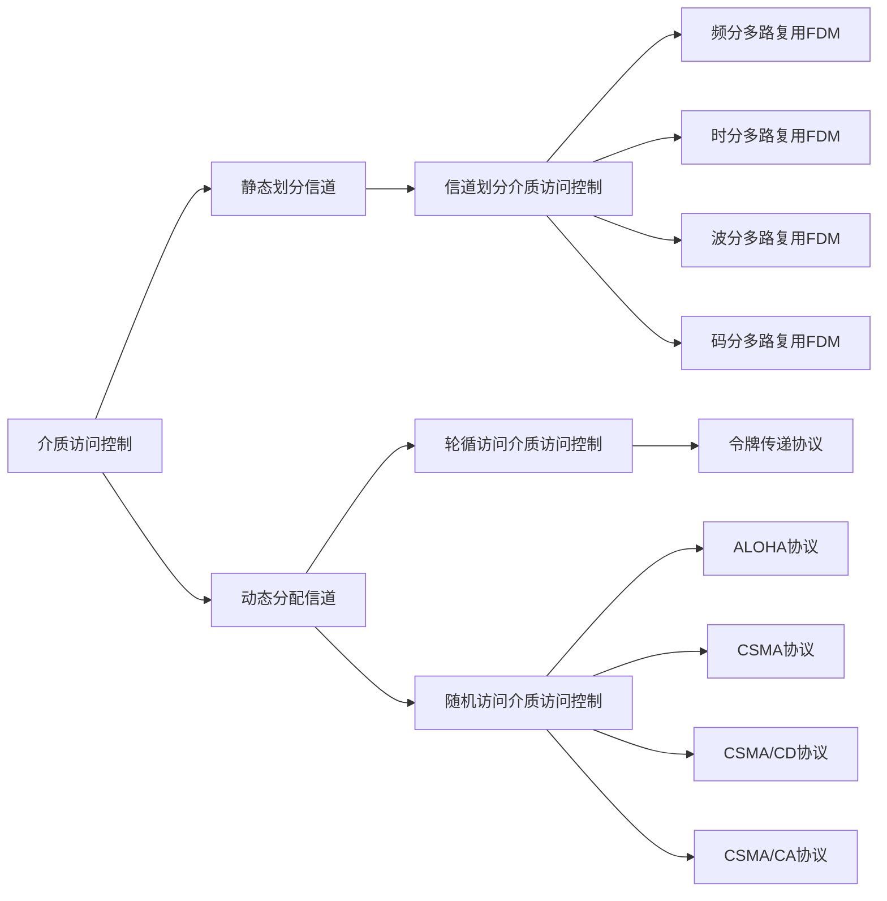

# 数据链路层


结点：主机、路由器

链路；网络间两个结点的物理通道

数据链路：两个结点之间的逻辑通道，把实现控制数据传输协议的硬件和软件加到链路上构成数据链路

帧：链路层协议数据单元，封装网络层数据报

数据链路层在物理层提供服务的基础上向网络层提供服务，其最基本的服务是将源自网络层的数据可靠的传输给相邻结点的目标网络层。其主要作用是加强物理层传输原始比特流的功能，将物理层提供的可能出错的物理连接改造成逻辑上无差错的数据链路，使之对网络层表现一条无差错的链路

1. 为网络层提供服务。无确认无连接服务，有确认无连接服务，有确认有连接服务
2. 链路管理，连接的建立、维持、释放
3. 组帧
4. 流量控制
5. 差错控制（帧错、位错）

组装成帧：在一段数据前后部分添加首部和尾部，这样就组成了一个帧

接收端在接收到物理层上交的比特流时，就能根据首部和尾部的标记，从比特流中识别帧的开始和接束，首部和尾部的一个重要功能就是帧定界

帧同步：接收方能从接收到的比特流中可以识别出帧的其实和结束

字符计数法：帧首部使用一个技术字段来表明帧内的字符数

字符填充法：

零比特填充法：

违规编码法：如果 高低代表1低高代表0，那么可以吧低低和高高作为边界

差错从何而来;概括的说，差错都是由于噪声产生的

​	全局性：有与线路本身的电气特性导致的随机噪声，解决办法提高信噪比

​	局部性：外界特定的原因造成的短暂的冲击，用编码方式解决

差错的方式:

​	位错：0变成1\1变成0

​	帧错：丢失、重复、失序

链路层的差错控制：


在数据发送前先按某种关系附加上一定的冗余位，构成符合某一规则的码字后再发送。当发送的有效数据变化时，相应的冗余位也跟随变化，使码字遵循不变的原则，从而判断是否出粗。

数据链路层编码和物理层编码：

物理层编码是针对的单个比特，解决传输过程中比特的同步问题，如曼彻斯特编码

数据链路层的编码是针对的一组比特，他通过冗余码技术实现检验一组二进制比特流传输过程中是否出错。

检错编码：

​	奇偶检验码：只能检查出季淑阁错误，检查能力为50%

​	循环冗余码：

数据链路层的流量控制

较高的发送速度和较低的接收速度能力不匹配，会造成传输错误

数据链路层的传递是点对点的，传输层传输是端到端的

数据链路层的流量控制手段：接收方就不回复确认

传输层的流量控制手段：接收端发送一个窗口公告

流量控制方法

​	停止-等待协议：每发送完一个帧就停止发送，等待对方的确认，对方确认后再继续发送

​	滑动窗口协议：达到了流量控制，和可靠传输

​			后退n帧协议GBN

​			选择重传协议SR

帧丢失

```sequence
Note left of 发送方:发送0帧
发送方->接收端:
Note right of 接收端:确认0帧
接收端->发送方:ack0
Note left of 发送方:发送1帧
发送方-->接收端: 丢失
Note left of 发送方:超时计时器：每次发送一个帧就开始启动
发送方->接收端: 重传1帧
Note right of 接收端:确认1帧
接收端->发送方:ack1

```
ack丢失

```sequence
Note left of 发送方:发送0帧
发送方->接收端:
Note right of 接收端:确认0帧
接收端->发送方:ack0
Note left of 发送方:发送1帧
发送方->接收端: 发送1帧
Note left of 发送方:超时计时器：每次发送一个帧就开始启动
接收端-->发送方:ack1丢失
发送方->接收端: 重传1帧
Note right of 接收端:确认1帧
接收端->发送方:ack1

```

ack迟到

```sequence
Note left of 发送方:发送0帧
发送方->接收端:
Note right of 接收端:确认0帧
Note left of 发送方:超时计时器：每次发送一个帧就开始启动
Note left of 发送方:重复发送帧
Note right of 接收端:确认0，但是很久接收端没收到

接收端-->发送方:ack0
发送方->接收端: 重传0帧
Note right of 接收端:丢弃重复的0帧，重传确认0
接收端->发送方:ack0
Note left of 发送方:收到之前传过来的确认0，直接丢弃
```

信道利用率：发送方在一个发送周期内，有效的发送数据所需的时间占整个发送周期的比例
$$
信道利用率=(L/C)/T
$$
L:T内发送L比特的数据

C：发送方的传输速率

T：发送周期，从开始发送数据到第一个确认帧

后退n帧的滑动窗口协议

发送窗口：发送方维持一组连续的允许发送的帧的序号

接收窗口：接收方维持一组连续的允许接收帧的序号

GBN发送方必须相应的三件事

1. 上层的调用：上层发送数据时，发送方先检验发送窗口是否已满，如果为满，取一个帧发送，如果满了，发送方返回给上层，通知发送窗口已满（通常发送方就可以缓存）
2. 收到了一个ack，GBN协议对n号帧采取累计确认方式，如果接收到7号帧，那么代表7号帧之前的帧全部正确接收
3. 超时协议的名字为回退n帧，如果超时，发送方重发所有的已发送但是未确认的帧，即便有些已经发送

GBN接收方：如果正确收到n号帧，那么接收方发送一个n帧对应的ack，并将该帧中的数据交给上层

   			其余情况都会丢弃帧，并为最近按需接收的帧重新发送ack。

滑动窗口长度：todo


选择重传协议：SR

发送方：

1. 上层的调用从上层接收到数据时，发送方检查下一个可用于该帧的序号，如果序号位于发送窗口内，则发送数据帧，否则将数据缓存
2. 受到ack加入到该帧的窗口处，则发送方将那个已确认的帧标记为已接收，如果该帧的序号是下界（最左边窗口对应的序号），则窗口向右移动到最小的未确认的帧，如果窗口移动了，此时窗口内有未发送的帧，那么就发送他们
3. 每个帧都有自己的定时器，一个超时事件发生后只重传这一个帧

接收方：

来者不拒（窗口内的帧）

SR确认帧将一个正确接收的帧而不管其是否按序，失序时将被缓存，并返回一个该帧的确认帧（收谁确认谁），直到所有帧（序号更小的帧）都被收到为止，这时才把一批帧交付给上层，并且向前滑动窗口，如果接收到了窗口序列外的帧，就返回一个ack，其他情况就忽略该帧


滑动窗口长度：接收端等于发送端

总结：对数据帧逐一确认，收到一个确认一个

​	只重传出错帧

​	接收方有缓存

传输数据使用的两种链路

点对点链路：两个相邻节点没有第三者，只是通过一个链路连接。应用ppp协议，常用于广域网

广播式链路：所有主机共享通信介质常用于局域网

介质访问控制：采取一定的措施，使两个节点之间的通信不会发生互相干扰的现象




频分多路复用：用户分配到一定频带后，在通信过程中自己始终占用这个频带，频分复用的用户同样的时间占有不同的频带。充分利用传输介质的带宽，系统效率较高，技术比较成熟

时分多路复用：将时间划分成一段段等长的时分复用帧。每一个时分复用的用户在每一个TDM帧中占有固定序号的时隙，所有用户轮流占用信道

​	TDM帧在物理层传送波特刘所划分的帧，标志一个周期。

​	改进的时分复用法-统计时分复用：每一个STDM帧中的时隙数小于连接在集中器的用户数，各用户有了数据就集中发往集中器的缓存中，然后集中器按顺序依次扫描输入缓存，把数据放入到STDM帧中，一个帧满了就发出。
STDM不是固定分配时序，而是按需动态分配时序。

波分多路复用：就是光的频分多路复用，在一根光纤中传输多种不同波长（频率）的光信号，由于波长不同，各个波不会互相干扰，最后再用波长分解复用器把各路波长分解出来。使用合波器和分波器

码分多路复用：todo

令牌传递协议：令牌，一个特殊的mac控制帧，不含任何信息只是控制信道的使用，确保只有一个结点占用信道，常用于负载较重，通信量较大的网络中。

纯ALOHA协议：不监听信道，不按时间槽发送，随机重发，想发就发。

如何检测冲突:如果发生冲突，接收方就会检测出差错，然后不予确认，发送方在一段时间内接收不到回馈就判断发生冲突

冲突解决：随机时间后重发

时隙ALOHA：把时间分成多个相同的时间片，所有用户在时间片开始时同步接入网络信道，若发生冲突，则等下一个时间片在重新发送

纯ALOHA比时隙ALOHA效率更低，吞吐量也更低

纯ＡＬＯＨＡ想发就发，时隙ALOHA要等到下一个时间片才可以发送

#### ＣＳＭＡ协议

cs载波监听：每次发送之前都要检测一下总线上是否有其他计算机在发送

​	当几个站同时在总线上发送数据时，总线上的电压摆动值将会增大。当一个站点检查到的信号电压摆动值超过了一个阈值时，就认为至少有两个站在发送数据，表明产生了碰撞和冲突。

ｍa：多点接入：表明计算机以多点接入的方式接在一个总线上

协议思想：发送数据前监听信道。

坚持：监听到信道忙后是否继续监听

１坚持ＣＳＭＡ思想:如果一个主机要发送消息，那么它先监听信道，如果空闲直接传输，如果忙就一直监听，直到空闲马上发送，如果有冲突（一段时间内未收到肯定回复），则等待一个随机长的时间再监听

​	优：只要媒体空闲，立马发送，避免了媒体利用率损失

​	缺：假如有两个以上的站同时发送，冲突不可避免

非坚持ＣＳＭＡ：如果一个主机要发送消息，那么它先监听信道，如果空闲直接传输，如果忙就等待一个随机时间再进行监听。

​	优：采取随机重发延时时间可以减少冲突发生的可能性

​	缺：可能存在大家都在等待的过程中，使得媒体可能处于空闲状态

ｐ坚持CSMA　：如果一个主机要发送消息，那么它先监听信道空闲则以ｐ的概率直接传输，不必等待，概率１－ｐ等到下一个时间槽再发送，忙则等待一个随机时间再监听

如何确定重传时机：截断二进制指数规避算法

1. 确定基本退让时间为争用期２τ
2. 定义参数ｋ它等于重传次数，但ｋ不超过１０。即ｋ＝min[重传次数，１０ ]
3. 从离散的整数集合[ 0,1, $ 2^k-1 $]中随机取出一个数ｒ，重传的所需避让时间就是ｒ倍的基本退让时间。即２ｒτ
4. 当重传超过１６次仍然不成功，说明当前网络太拥挤，认为此帧永远无法发出，抛弃此帧向上层报告

第一次重传ｋ＝１，ｒ从[0,1]中取重传推迟时间０或２τ。再次碰撞从[0,1,2,3]，推迟时间0,2τ，４τ，６τ中取一个数字、、、

最小帧长：
帧的传输时延至少两倍于信号在总线中的传播时延
$$
\frac{帧长}{数据传输速率}>=2τ
$$
最小帧长＝总线传播时延＊数据传播速率＊２

ＣＳＭＡ/CA协议工作原理：预约信道，ａｃｋ帧，ｒｔｓ/ｃｔｓ帧

发送数据前，先检验信道是否空闲，空闲发送RTS(request to send)。RTS包括发射端的地址，接收端的地址，下一份数据将持续发送的时间，信道忙则等待

接收端接收到RTS后，相应CTS(clear to send)

发送端接收到RTS后开始发送数据帧（同时预约信道，发送方告诉其他站点自己要传多久数据）

接收端接收到数据帧后，将用ＣＲＣ来检测数据的正确性，正确的话响应ａｃｋ

发送方接收到ａｃｋ就可以进行下一个数据帧的发送，若没有则一直重传到规定的重传次数为止

ＣＳＭＡ/CＤ

与ＣＡ相同都属于CSMA思路，先听再说，两个接入到信道都需进行监听，发现信道空闲后才可以接入

区别：

​	１传输介质ＣＤ总线式以太网ＣA无线网

​	２载波检测方式ＣＤ通过电缆中电压变化ＣＡ使用能量检测ＥＤ载波检测ＣＳ能连载波混合检测

